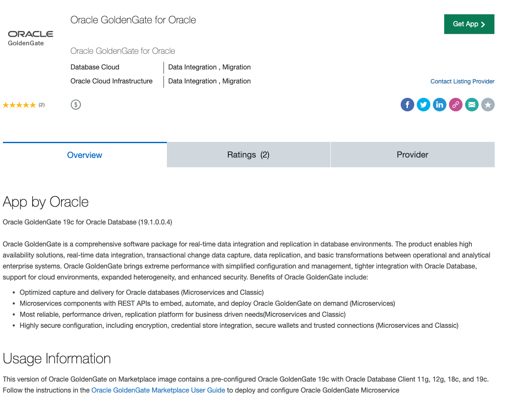
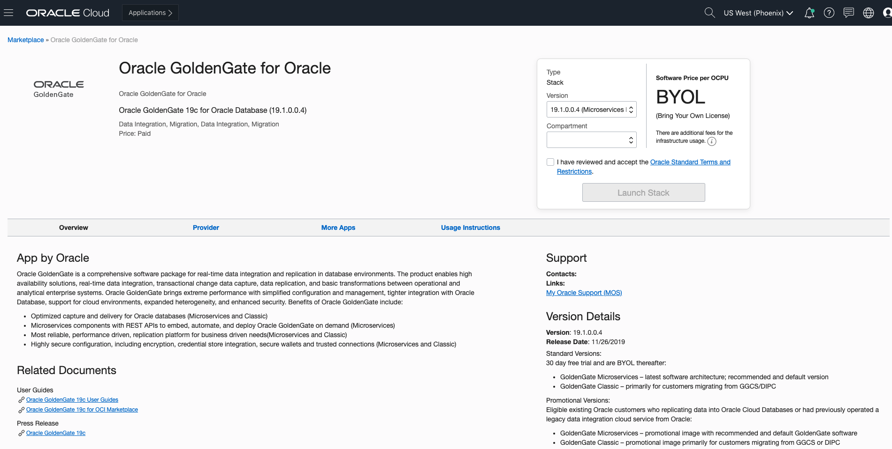
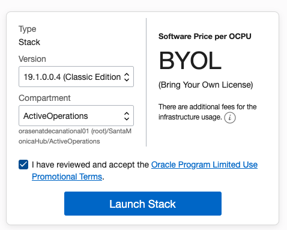
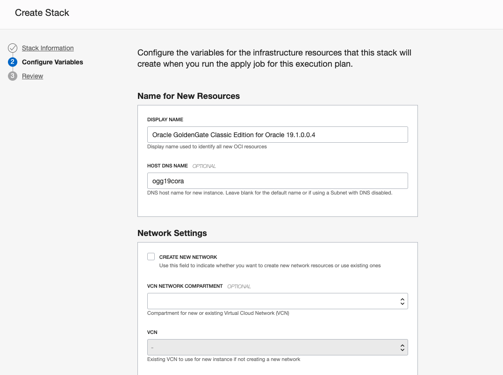
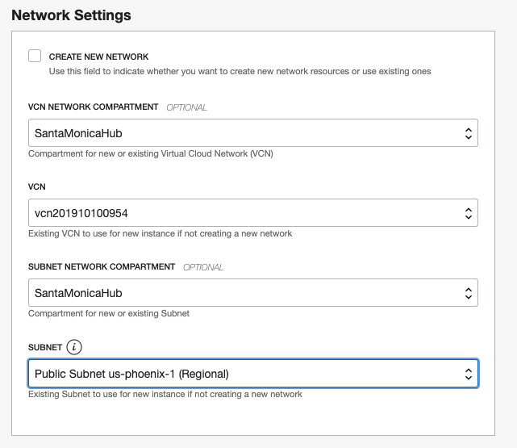

# Workshop: Oracle Database to Autonomous Database with GoldenGate

## Introduction

Welcome to the introduction to the Oracle Goldengate database synchronization workshop. This workshop will introduce you to the most advanced database synchronization technology available today.

In the next two - twenty four hours you will experience a day in the life of Tim Robinson -- a database administrator for the fictitious company Alpha Office. Tim has been hired to move their existing database system (11G) to the autonomous database with zero downtime on workload. In this workshop you will take on Tim’s persona to build a data pipeline from a 11g database to a 19c database utilizing Oracle’s Goldengate synchronization tool. In doing so, you will leverage the latest and most advanced Oracle open-sourced technologies.

As Tim, you will spin up a new Oracle Goldengate Image from the Oracle Marketplace, an 11g Oracle database, and an autonomous data warehouse to quickly and easily employ a complete synchronization environment available in any location.

By doing so, you will gain breadth in creating multiple database environments and functionality. And, will learn to use a comprehensive software package for real-time data integration and replication in heterogeneous IT environments with simplified configuration and management. 

To log issues, click here to go to the github oracle repository issue submission form.
If you have any questions, please contact the authors&instrcutors of this workshop:
Ji Zhang (ji.j.zhang@oracle.com)
Alex MacDonald(alex.macdonald@oracle.com)

## Useful links:
### [Download SQL Developer](https://www.oracle.com/technetwork/developer-tools/sql-developer/downloads/index.html)
### [GoldenGate Marketplace image](https://cloudmarketplace.oracle.com/marketplace/en_US/listing/58489224)
### [Information on the GoldenGate MarketPlace Promotion](https://blogs.oracle.com/dataintegration/free-goldengate-software-on-oci-marketplace)
### [GoldenGate 19.1 documentation](https://docs.oracle.com/en/middleware/goldengate/core/19.1/index.html)
### [Fundamentals youtube course](https://www.youtube.com/watch?v=uQ8eKJmPfwY&list=PL3Hc8S1SG2ATGktXhC3WA5YYVI_wBcFYR)
### [How to create a ssh key](https://www.oracle.com/webfolder/technetwork/tutorials/obe/cloud/javaservice/JCS/JCS_SSH/create_sshkey.html)
### [How to use vi on a terminal session](https://staff.washington.edu/rells/R110/)

## Outline:

### [Lab 100: Create Goldengate usernames in source and target DBs](https://github.com/GaryHostt/GoldenGate2ADB/blob/master/Lab100.md)
### [Lab 200: Setup connections to Source DB and target DB](https://github.com/GaryHostt/GoldenGate2ADB/blob/master/Lab200.md)
### [Lab 300: Extract and Pump processes configuration](https://github.com/GaryHostt/GoldenGate2ADB/blob/master/Lab300.md)
### [Lab 400: Replicate process configuration](https://github.com/GaryHostt/GoldenGate2ADB/blob/master/Lab400.md)
### [Lab 500: GoldenGate in-action](https://github.com/GaryHostt/GoldenGate2ADB/blob/master/Lab500.md)
### Lab 600: Configuration for capturing DDL changes (optional)
### Lab 700: Configuration for databases with multi-tenant architecture (optional)

# Pre-requisites

## 1.	[Create a GoldenGate classic instance from the marketplace](https://cloudmarketplace.oracle.com/marketplace/en_US/listing/58489224)

Going to the link will take you to this page, press get app.

Select the compartment of your tenancy where you would like GoldenGate to reside. 

In this case, we are using the classic edition of GoldenGate. A separate lab will address GoldenGate microservices.

You can put GoldenGate inside of an existing VCN or have the wizard create a new one for you. 

For this lab, make sure that GoldenGate is inside of a public subnet. 

After reviewing, allow some time for the instance to provision. 

## 2. Provision an Oracle 11G database on DBCS on OCI

After provisioning the database, you will have to install SQL*Plus on that instance. 

[About DBaaS on OCI](https://docs.cloud.oracle.com/en-us/iaas/Content/Database/Concepts/overview.htm)
[How to provision a database instance] (https://docs.cloud.oracle.com/en-us/iaas/Content/Database/Tasks/creatingDBsystem.htm)

Allow some time for your 11G instance to provision.

## 3. Provision an Autonomous Data warehouse

[Click here to see the steps to provision an Oracle Autonomous data warehouse on OCI](https://oracle.github.io/learning-library/workshops/journey4-adwc/?page=LabGuide1.md)

[You will need your database wallet to create a SQL*plus connection from GoldenGate and upload it to the GoldenGate VM](
https://oracle.github.io/learning-library/workshops/journey4-adwc/?page=README.md) 
