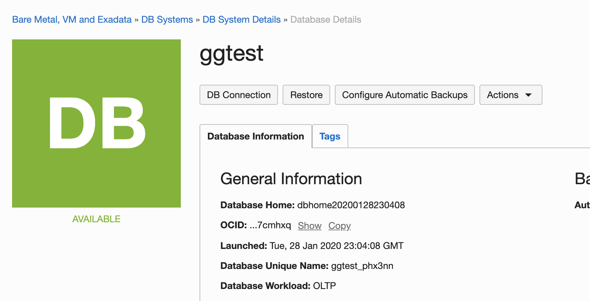
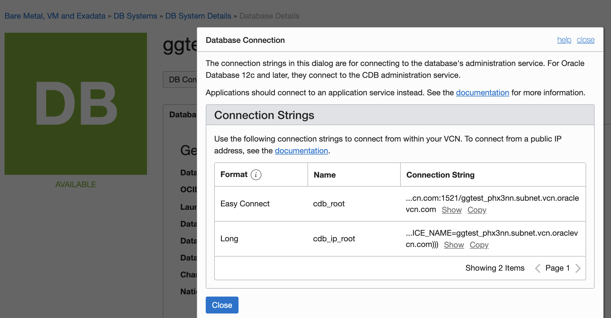
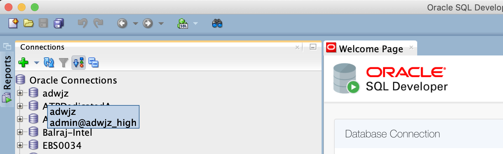
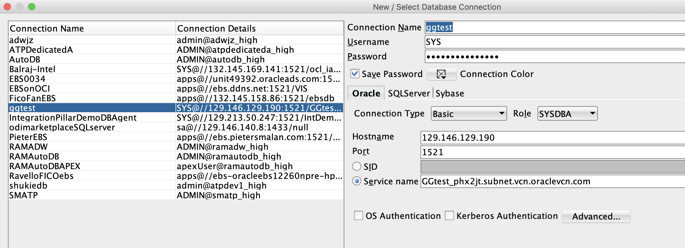
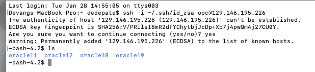

# Lab 100: Create Goldengate usernames in source and target DBs
## 1. Create GG user in source DB:



After spinning up an 11G instance, you can click on the database and you will go to this screen. Click the DB Connection box. 


Copy the easy connection string for later.


Open SQL Developer and press the green checkbox to create a connection.


Connect to your 11G database on SQL Developer. Your username is SYS, make sure you have the role set to SYSDBA. The service name is part of the easy connection string. 


You can also ssh into your database node, you can obtain the public IP address from the node details on the database page. Follow the ssh -i syntax in the above screenshot.

Next, confirm if there’s any existing GG users with the commands below in SQL Developer.

```
SELECT username FROM dba_goldengate_privileges;
```

If no GG user exists, let’s go ahead and create a user:
```
create user ggadmin identified by WELcome__12345 default tablespace system temporary tablespace temp;
grant connect, resource to ggadmin;
grant select any dictionary to ggadmin;
grant create view to ggadmin;
grant execute on dbms_lock to ggadmin;
grant Dba to ggadmin;
exec dbms_goldengate_auth.GRANT_ADMIN_PRIVILEGE('ggadmin');
ALTER DATABASE ADD SUPPLEMENTAL LOG DATA;
ALTER SYSTEM SET enable_goldengate_replication=TRUE scope=both;
```

Then, login as ggadmin, and create the tables for this lab by running the below command.

```
CREATE TABLE Channels (
 supplier_id numeric(10) not null,
 CONSTRAINT supplier_pk PRIMARY KEY (supplier_id)
);
```
## 2. Configure GG user in target ADW

Unlock the pre-created oracle goldengate user (ggadmin), with the below command in SQL Developer. 

```
alter user ggadmin identified by <password> account unlock;
```
Then make sure goldengate is enabled:
```
select * from v$parameter where name = ‘enable_goldengate_replication’;

```
Also grant writing access the the tablespace:
```
alter user ggadmin quota unlimited on DATA;
grant unlimited tablespace to ggadmin;
```
Then create the same table from the source database, on the target database:
```
CREATE TABLE Channels (
 supplier_id numeric(10) not null,
 CONSTRAINT supplier_pk PRIMARY KEY (supplier_id)
);
```
[Click here if you would like to learn more about the initial data load process with GoldenGate.](https://www.youtube.com/watch?v=kZNCQtopxbQ&list=PLWPirh4EWFpF_rllJZe94wGLm8yPIRhBv&index=11)
Good job, you have finished lab 100! [Click here to continue to lab 200.](https://github.com/GaryHostt/GoldenGate2ADB/blob/master/Lab200.md)
