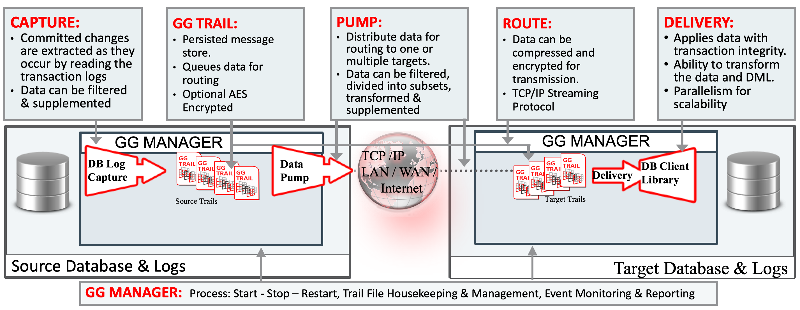
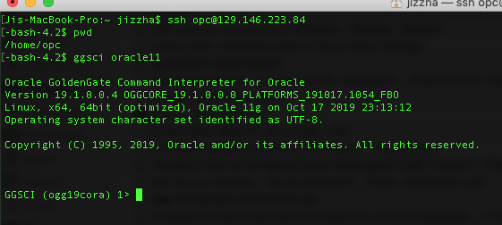

# Lab 300: Extract and Pump processes configuration	

Continuing from lab200, we are about to set up the entire GoldenGate pipeline, which includes Extract (the source database log capture), Pump and Replicat (delivery to target database) processses. 


As shown in the picture above, we need 2 GoldenGate instances, one is version 11 for connecting to source (Oracle 11g Database), one is version 18 for connecting to target (ADW, database version is 18). Since we provisoned the Virtual Machine using Oracle GoldenGate MarketPlace image, which contains 4 different GoldenGate instances (version 11, 12, 18, 19) on the same VM, we can use the version 11 to capture, and use the version 18 to deliver. Therefore, the two GoldenGate instances we are using in this workshop, actually sits inside the same virtual machine.

Let's start with the data source side, in this lab, we will set up the extract and pump processes. To set up the GoldenGate extract process, we need to add trandata and create the checkpointtable for the GoldenGate users, so let's ssh into the GoldenGate MarketPlace image VM, and then open GoldenGate 11 use this command:
```
ggsci oracle11
```


Then, login source database using the useridalias we created in lab 200 and run these commands.

```
dblogin useridalias DB11G
add schematrandata ggadmin
add checkpointtable ggadmin.checkpointable
```
Now the source side is ready, we can start creating extact process.
Use this command to create and configure an Extract process. 
(Here we name our extract process EXT, note that the name cannot exceed 8 characters)
```
edit param EXT 
```
input the following contents
```
extract EXT
TRANLOGOPTIONS DBLOGREADER
useridalias DB11G
exttrail ./dirdat/EX
table ggadmin.CHANNELS;
```
here, "extract EXT" defines the process type and name;

"TRANLOGOPTIONS DBLOGREADER" is the tran option applied;

"useridalias DB11G" is the login credential to the data source;

"exttrail ./dirdat/EX" defines the external trail file name and path;

"table ggadmin.CHANNELS;" defines the schema and table we want to synchronize (note that a ';' is required at the end);

save this param file, (From the above process, a param file called ext.prm will be generated inside ./dirprm/ folder)


We have the extract parameter ready, let's add it into goldengate:
```
add extract EXT, tranlog, begin now
add exttrail ./dirdat/aa, extract EXT
```
here, the first command adds an extract process called EXT to goldengate manager process;

the second command adds an external trail file path, and tells the manager that the extract EXT process will use it to store all the transaction info.

Now we have the extract process ready, next let's configure the pumping process.

Configure Pump process
```
edit param PMP
```
input the following contents
```
extract PMP
RMTHOST localhost, MGRPORT 10008
RMTTRAIL /home/opc/oracle18/dirdat/cc
PASSTHRU
TABLE ggadmin.CHANNELS;
```
here, "extract PMP" defines the process type and name, note that the PUMP is a kind of "extract" process in the system;

"RMTHOST localhost, MGRPORT 10008" defines the target GoldenGate instance (GoldenGate version 18) and its manager port.  ;

"RMTTRAIL /home/opc/oracle18/dirdat/cc" defines the target trail file name and path on the target GoldenGate instance;

"PASSTHRU" means the process will only transfer the trail from source to target, no modifications;

"table ggadmin.CHANNELS;" defines the schema and table we want to synchronize (note that a ';' is required at the end);

save this param file, (From the above process, a param file called pmp.prm will be generated inside ./dirprm/ folder)


We have the pump parameter ready, let's add it into goldengate:
```
add extract PMP, exttrailsource /home/opc/oracle11/dirdat/aa, begin now
add rmttrail /home/opc/oracle18/dirdat/cc, extract PMP
```
here, the first command adds this pump process called PMP to goldengate manager process, tell the system it will use this file: "/home/opc/oracle11/dirdat/aa" as external source;

the second command adds an remote trail file path (it locates on the target GoldenGate machine), and tells the manager that the PMP process will use it to store all the transaction info.

Now we have the pump process ready, next let's continue working on the pipeline in the next lab:
[Click here to go to Lab400](https://github.com/zzhangjii/GoldenGate2ADB/blob/master/Lab400.md)
