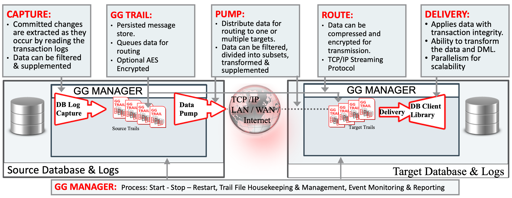

# Lab 400: Replicate process configuration
​
Continuing from lab300, let's configure the replicate process on the target Goldengate version 18.

​
run the following command to open the console for Goldengate version 18
```
ggsci oracle18
```
login the target ADW using the useridalias we created in lab200
```
dblogin useridalias ADW
```

Before we set up the GoldenGate replicat process, we need to do the following 3 pre-configurations inside ggsci console:
1. configure the Goldengate manager;
the Goldengate manager 

2. configure the GLOBALS parameter;
3. create the checkpointtable for the GoldenGate users in target ADW; 

​
Configure mgr dynamic ports
```
edit param mgr
Add line
DYNAMICPORTLIST 10020-10030
stop/start mgr
```
Configure ./GLOBALS
```
edit param ./GLOBALS
Add line
ALLOWOUTPUTDIR /home/opc/oracle18/dirdat/
```
Configure Replicate process
```
edit param REP (INSERT SCREENSHOT)
add replicat REP, exttrail /home/opc/oracle18/dirdat/cc, begin now, checkpointtable ggadmin.ggschkpt
```
​
[Click here to go to lab 500](https://github.com/GaryHostt/GoldenGate2ADB/blob/master/Lab500.md)
