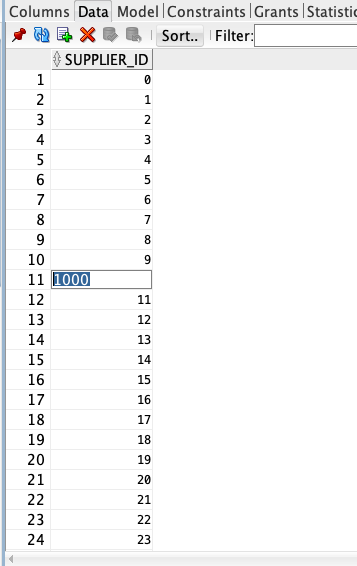
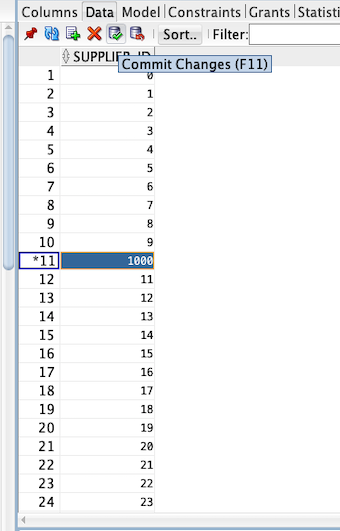
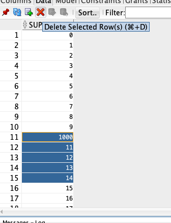

# Lab 500: GoldenGate in-action
​
If you have reached this lab, then you have configured a full GoldenGate migration data sync. All that is left is to monitor your processes to see if they're working correctly. So let's continue.
1. start the pipeline
First, open the Goldengate 11 console
```
ggsci oracle11
```
start the extract and pump process on source side
```
Start *
```
Ensures all extract processes have started
```
info all
```
Ensures each processes is correctly working
```
view report (EXT/PMP)
```
Ensures logging file is created
```
cd oracle11/dirdat/
```
Checks if file exists

Repeat for target side Goldengate version 18
open the console for GG 18
```
ggsci oracle18
```
start the replicat process
```
Start *
```
Ensures all extract processes have started
```
info all
```
Ensures each processes is correctly working
```
view report REP
```

2. data synchronization test--INSERT

Within SQLDeveloper, connect to both source Oracle 11g database and target ADW.

In source database's SQL worksheet, let's insert some data to the table CHANNELS using the following SQL statements:
```
BEGIN
    for i in 0 .. 20
    loop
        INSERT INTO CHANNELS VALUES(i);
    end loop;
    commit;
END;
```
Now let's check the target database, see if the table "CHANNELS" gets synchronized.

Then, let's check the stats in Goldengate 11
```
ggsci oracle11
stats extract EXT
stats extract PMP
```
also, check the Goldengate 18 side
```
ggsci oracle18
stats replicat REP
```
you shoule be able to see both sides record 10 inserts.
​
3. data synchronization test--UPDATE and DELETE

now let's try some updates for table CHANNELS on source side, for example, change the value of ROW11 from 10 to 1000;

and commit the change we just made.

Now let's check the target database, see if the table "CHANNELS" gets synchronized.

Similarly, let's try delete ROW11-15 (usethe red cross) and commit the changes (use the green check)


Then, let's check the stats in Goldengate 11
```
ggsci oracle11
stats extract EXT
stats extract PMP
```
also, check the Goldengate 18 side
```
ggsci oracle18
stats replicat REP
```
you shoule be able to see both sides record 1 update and 5 deletes.

Congratulations, you have completed your day in the life of Tim successfully. 
